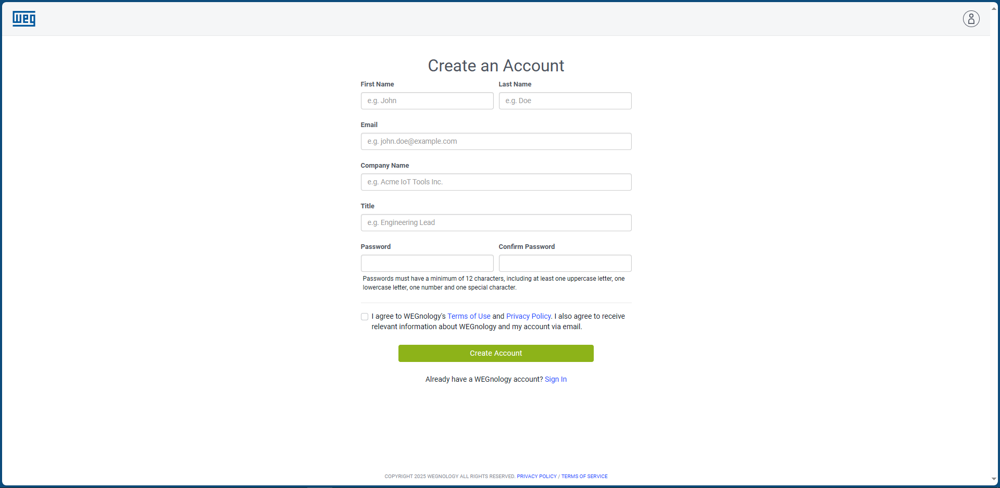
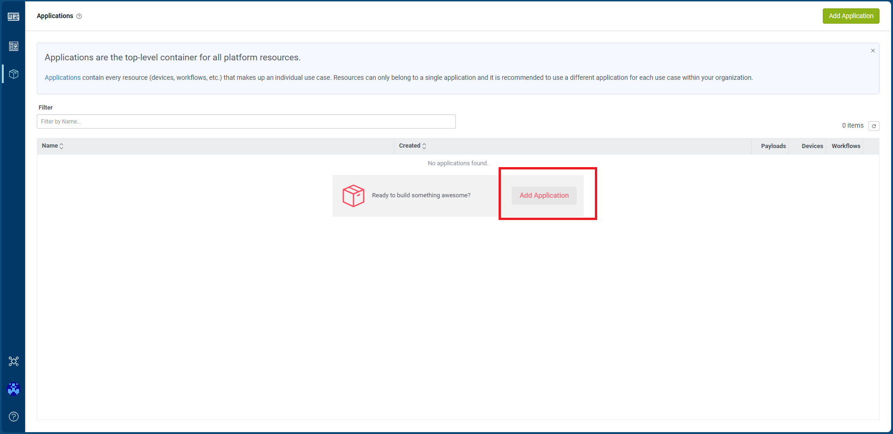
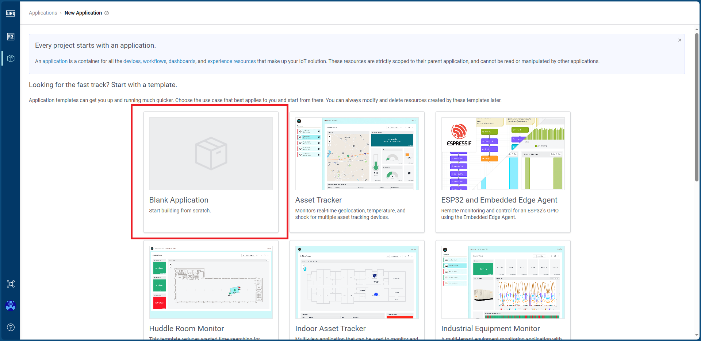
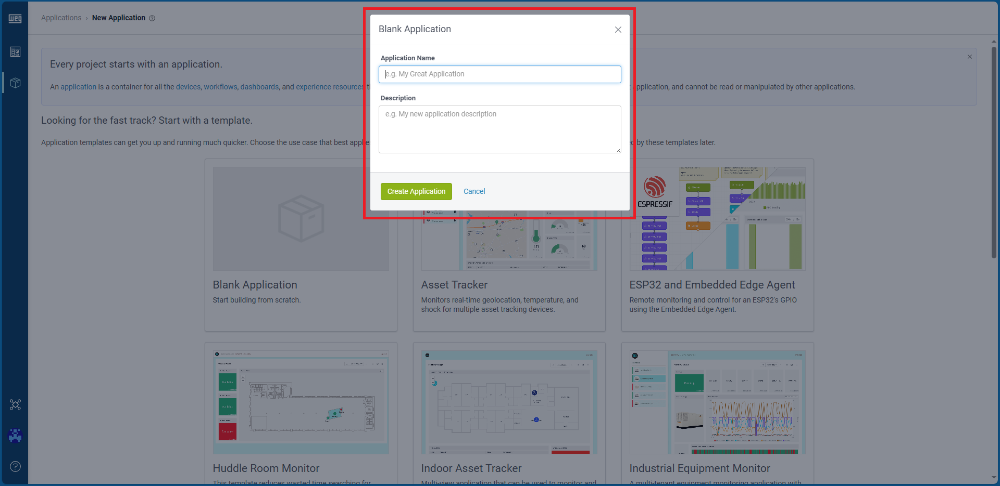

# Em construção...

# Guia de como utilizar React com Typescript no WEGNology

## Criando um projeto no WEGNology

Este primeiro tópico é responsável por auxiliar na criação de uma conta e um projeto
na plataforma [WEGNology](https://accounts.app.wnology.io/signin)

1. Criar uma conta:
   Acesse o link <https://accounts.app.wnology.io/create-account> e preencha os
   campos corretamente



2. Após criar sua conta, você será redirecionado para esta página:



3. Depois de clicar em Add *Application*, você irá precisar selecionar a opção de
*Blank Application* como mostra a imagem abaixo:



4. Preencha os campos que vão aparecer corretamente:



## Instalando dependências de projeto

Para instalar as dependências de projeto é necessário executar o seguinte comando:

```
npm install --legacy-peer-deps
```

Este comando é responsável por instalar as dependências no modo
legacy, ou seja, instalar as versões estáveis e que são compatíveis
com todos os pacotes listados em package.json.
